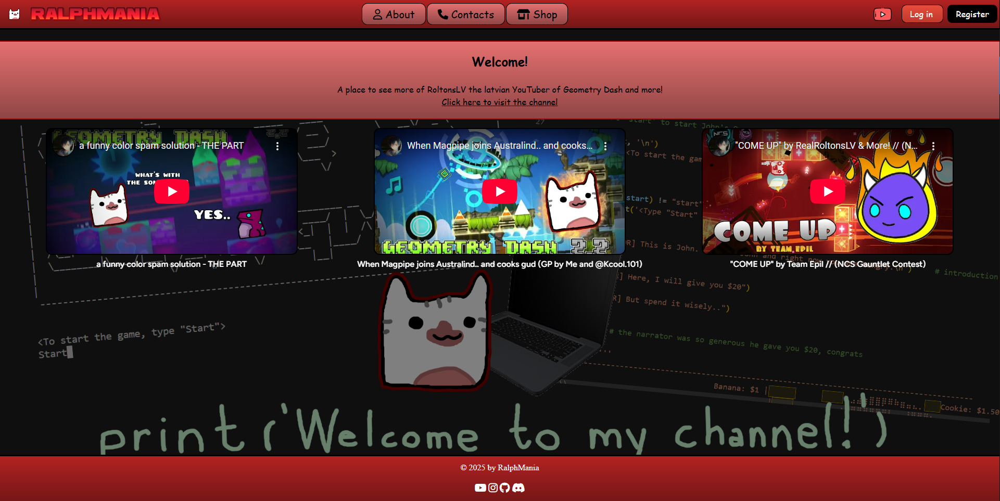
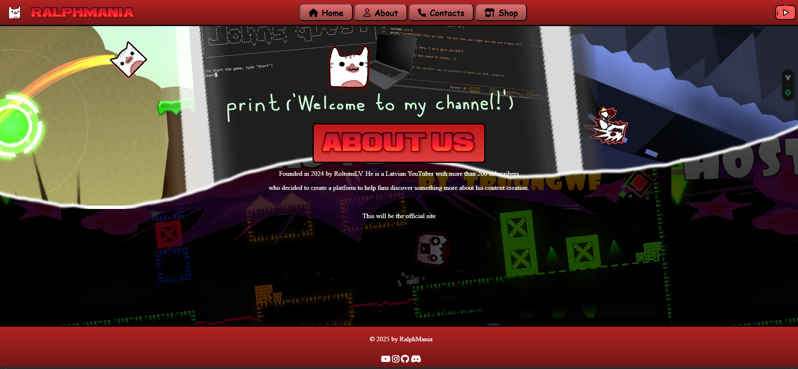
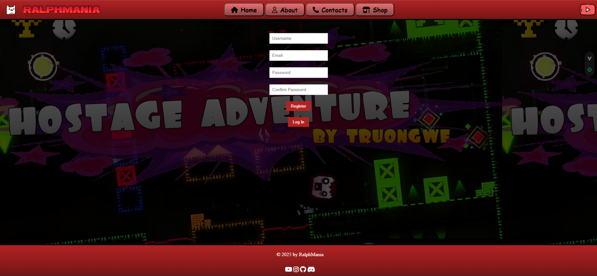

# RalphMania
Mājaslapa, kas parādīs jaunumus un aktualitātes par YouTuberi "RoltonsLV" jeb Ralfu Migalu. Šī būs domāta faniem

### Ielogošanās nolūki:
- kļūsti par fanu dalībnieku un saskati vairāk ko aktuālu, piemēram, kādi jaunumi par jauno video montāžām būs
- būsi spējīgs caur mājaslapu nodot atgriezenisko saiti YouTube kanāla un mājaslapas uzlabošanas labumā

---
## 1) Kas tiek rādīts? 👀
- pilns saturs par YouTuberi "RoltonsLV", lai iepazīstos ar personāžu, viņa veidoto saturu un arī mērķi
- 3 jaunākie YouTube video, kuri nesen tika publicēti (vairāk redzami reģistrētiem lietotājiem)
- pašā apakšā ir galvene ar sociālajiem medijiem, kurā "RoltonsLV" ir aktuāls

---
## 2) Veiktais progress: 💪
- Mājaslapas pamats ir izstrādāts
- Tika ieviests Vue (Front-End) - xx.01.2025
- Tika ieviests Laravel (Back-End) - 19.02.2025
- Nodrošināta Login/Register funkcija (ar SQLite) - 11.06.2025
- Paplašināta mājaslapa ar dažādām piekļuvēm reģistrētiem lietotājiem, piemēram:
    - redzēt vairāk par 3 video;
    - sniegt 5 zvaigžņu atsauksmes;
    - skatīt konktaktlapu un aizpildīt ailes, lai kontaktētu izpilddirektoru "RoltonsLV".

---
## 3) Kas atliek ko izdarīt? 📝
- Vajag uzlabot vizuālo izskatu un interfeisu;
- Papildināt Shop sadaļu;
- Paplašināt datu bāzi ar:
    - saturu + komenāriem;
    - produktiem + groziem + pasūtījumiem + maksājumiem;
- Uzlabot un nodrošināt mājaslapas responsivitāti.

---
## "RalphMania" mājaslapas izskats (pirms Laravel ieviešanas)
1. attēls - "Home" sadaļa

2. attēls - "About" sadaļa

3. attēls - "Contacts" sadaļa

